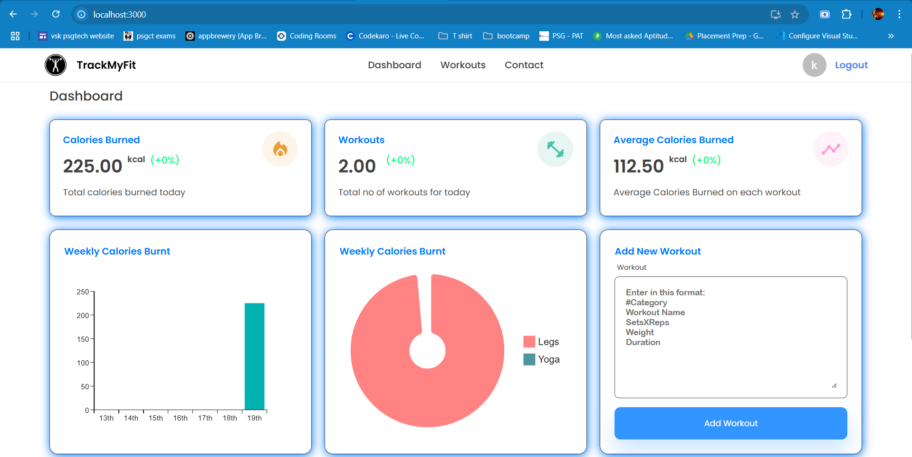

# TrackMyFit 🏋️‍♂️

**TrackMyFit** is a **MERN stack** web application designed to help fitness enthusiasts track workouts, monitor progress, and achieve their goals with ease.💪

## 🌟 Features

- **Workout Tracking**: Log workouts with details like category (e.g., Legs, Chest), exercise name, sets, reps, weight, and duration.
- **Interactive Dashboard**: View daily workouts and track progress with insightful stats.
- **Visual Analytics**: Beautiful pie charts and weekly stat cards to visualize workout distribution and calories burned.
- **Secure Authentication**: User sign-in with JWT-based authentication for a personalized experience.
- **Responsive Design**: Fully responsive UI built with Material-UI and styled-components, perfect for mobile and desktop.
- **Continuous Deployment**: Automatic updates via Netlify (frontend) and Render (backend) for a smooth development workflow.

## 🚀 Live Demo

Try FITFOREVER now!

- **Frontend**: https://trackmyfit.netlify.app
- **Backend API**: https://trackmyfit-backend.onrender.com

## 🛠️ Technologies

| Category | Technologies |
| --- | --- |
| **Frontend** | React, Material-UI, Styled-Components, Axios, Day.js |
| **Backend** | Node.js, Express, MongoDB, Mongoose, JWT, Bcrypt |
| **Deployment** | Netlify (Frontend), Render (Backend) |
| **CI/CD** | GitHub Actions, Netlify Auto-Deploy, Render Auto-Deploy |
| **Database** | MongoDB Atlas |

## 📸 Screenshots

| Login Page | Dashboard | Workout |
| --- | --- | --- |
|  |  |  |
